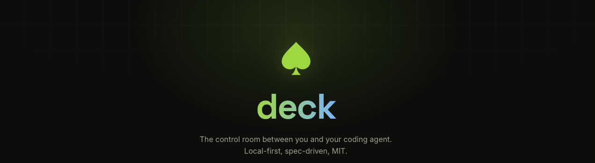
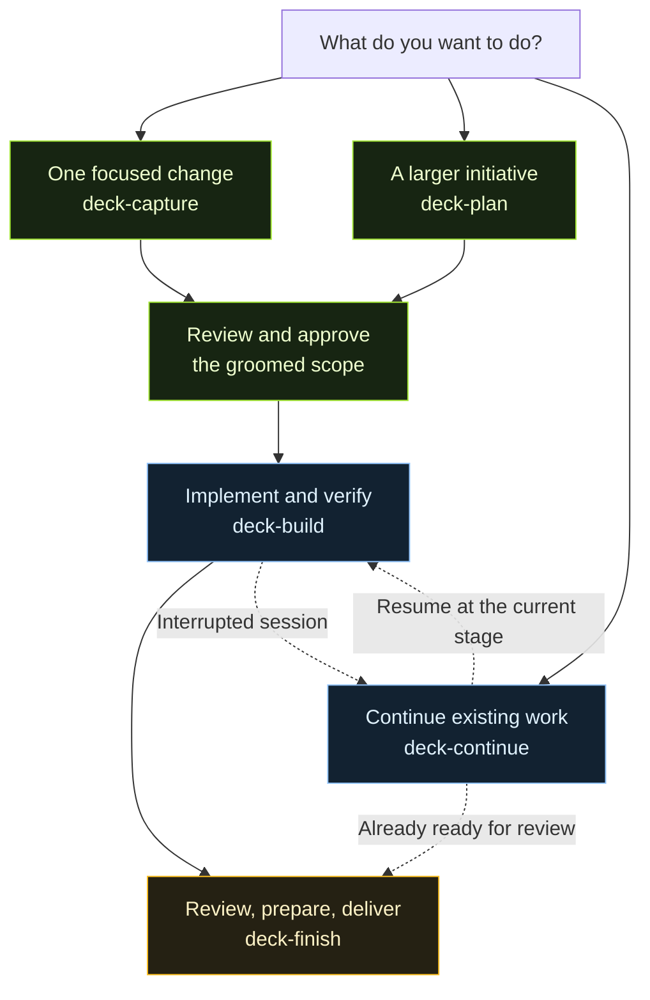
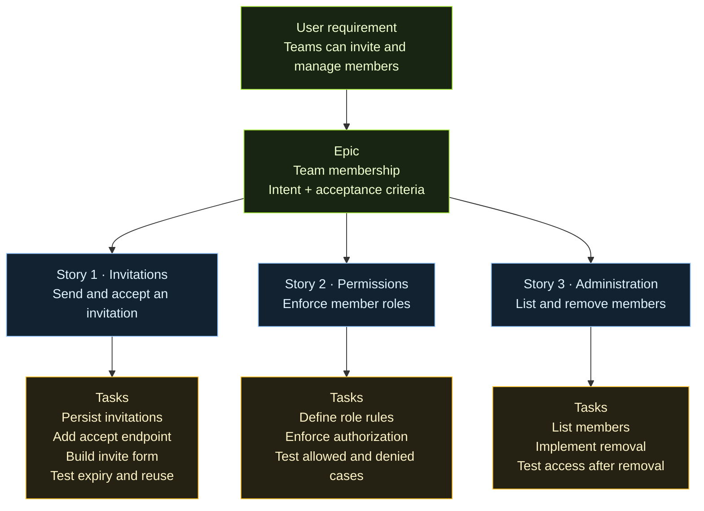
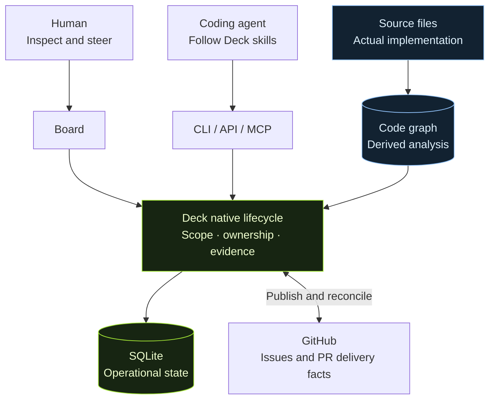

<p align="center">
  
</p>

<p align="center">
  <strong>Graph-native software delivery for humans and AI coding agents.</strong>
</p>

<p align="center">
  <a href="https://github.com/dgtalbug/deck/blob/main/LICENSE"></a>
  
  
</p>

<p align="center">
  <a href="#why-deck">Why Deck</a> ·
  <a href="#the-delivery-loop">The delivery loop</a> ·
  <a href="#get-started">Get started</a> ·
  <a href="#agent-skills">Agent skills</a> ·
  <a href="#project-status">Project status</a> ·
  <a href="#contributing">Contributing</a>
</p>

<p align="center">
  <a href="#your-first-change">Your first change</a> ·
  <a href="#from-a-requirement-to-a-work-plan">Planning big work</a>
</p>

---

Deck is a local-first, open-source software delivery system being built to turn a requirement into a specification, a graph-informed implementation plan, controlled execution, and verified completion—**all tied to the actual codebase**.

The board makes work visible. The CLI, API, MCP, and agent skills connect humans and agents to Deck's native lifecycle. GitHub integration carries work and delivery records into the tools teams already use.

> **Early development.** Deck's core foundations are implemented and undergoing stabilization. The full experience across every interface is still evolving. The workflow below describes the product direction; see [project status](#project-status) for current boundaries.

<br>

---

## Why Deck?

A coding session produces more than a diff. Requirements, decisions, dependencies, unfinished work, and test results need to survive the session—and remain connected when the code changes.

<table>
<tr>
<td width="50%" valign="top">

**Know what was agreed**

Versioned specifications preserve requirements, acceptance criteria, and planned tasks. Stable identities keep progress connected to the accepted scope.

</td>
<td width="50%" valign="top">

**Understand the impact**

Inspect code relationships before making a change. Capture the analysis behind the plan, with freshness and uncertainty visible.

</td>
</tr>
<tr>
<td width="50%" valign="top">

**Carry work across sessions**

Ownership, checkpoints, dependencies, and handoffs preserve the work context. Resume with the decisions and remaining tasks close at hand.

</td>
<td width="50%" valign="top">

**Make completion explainable**

Connect acceptance criteria to current verification evidence. Track delivery separately so a prepared PR and an observed merge remain distinguishable.

</td>
</tr>
</table>

**Agents reason. Deck enforces. Humans steer.**

Agents research, propose, and implement. Deck validates state transitions and records scope, ownership, and evidence. Human review and approval guide consequential decisions.

<br>

---

## The delivery loop

The target lifecycle connects intent, code, and evidence:

```mermaid
flowchart LR
    A["01 · Specify<br/>Agree on the outcome"] --> B["02 · Inspect impact<br/>Understand the code"]
    B --> C["03 · Plan & approve<br/>Define the work"]
    C --> D["04 · Apply<br/>Implement with ownership"]
    D --> E["05 · Verify<br/>Check against criteria"]
    E --> F["06 · Complete<br/>Record evidence & delivery"]
    E -. "Gaps found" .-> D

    classDef intent fill:#172512,stroke:#a3e635,color:#efffcf;
    classDef work fill:#122231,stroke:#93c5fd,color:#e0f2fe;
    classDef proof fill:#252113,stroke:#fbbf24,color:#fef3c7;
    class A,B,C intent;
    class D work;
    class E,F proof;
```



| Before a change | During implementation | At completion |
| :--- | :--- | :--- |
| Accepted requirements and criteria | Explicit ownership and checkpoints | Evidence for the accepted criteria |
| Recorded code impact and uncertainty | Progress against stable task identities | Review findings and remaining gaps |
| A reviewed implementation plan | Recovery and handoff context | Local integration or observed GitHub delivery |

The board's `todo → groomed → active → verify → done` lanes summarize the lifecycle. Engine operations govern starting, verifying, and completing work.

<details>
<summary><strong>Example: changing a shared permission check</strong></summary>

1. **Specify:** define who should be allowed to perform the action, including denied cases.
2. **Inspect:** find callers of the permission check and confirm uncertain graph relationships in source.
3. **Plan:** identify the affected behavior, implementation tasks, and required checks.
4. **Apply:** the agent implements the accepted change and records decisions and progress.
5. **Verify:** collect evidence for allowed and denied cases; investigate changes outside the planned impact.
6. **Complete:** retain the accepted scope, verification record, and delivery outcome.

This illustrates the intended workflow; it is not a claim that a specific permission change has been executed or verified.

</details>

<br>

---

## Get started

**Build from source today.** A one-command package installation is planned; it is not currently available.

Prerequisites: **Git** and **[Bun](https://bun.sh) 1.4+**. GitHub operations additionally require an authenticated [GitHub CLI](https://cli.github.com). Configure your coding agent separately.

### 1. Build Deck

```sh
git clone https://github.com/dgtalbug/deck.git
cd deck
bun install
bun run build
```

The build creates the `deck` executable in the repository root. Use its absolute path below, or add the executable to your `PATH`.

### 2. Connect your project

Run these commands in the Git repository you want Deck to manage. Replace both example paths with your actual locations.

```sh
cd /path/to/your-project
/path/to/deck/deck init
/path/to/deck/deck setup
/path/to/deck/deck note "Describe the change you want to make"
```

`init` registers the project and creates its local state. `setup` detects supported agent configuration and installs the corresponding skills, preserving customized skill files.

### 3. Open the board

```sh
/path/to/deck/deck serve
```

Open **[localhost:3325](http://127.0.0.1:3325)**. Keep this terminal running; use another terminal for further commands.

<details>
<summary><strong>What initialization changes</strong></summary>

Deck creates a local project database and default configuration, adds a managed guidance block to `AGENTS.md`, and adds database exclusions to `.gitignore`. Agent setup installs guidance for the supported hosts it detects and reports its actions.

For MCP clients, configure the client to launch the executable with `mcp` as its argument. Client setup depends on your agent host.

</details>

<br>

---

## Your first change

Capture a note, then use the board or an agent to clarify the requirements and submit a groomed proposal. Review the scope and inspect the relevant code before starting.

These commands assume `deck` is on your `PATH` and you are in the registered project root. Replace `<card-id>` with your card's actual ID.

| Step | Command | What it does |
| :--- | :--- | :--- |
| Inspect | `deck board` | Show current work |
| Research | `deck graph index` | Refresh the code graph |
| Start | `deck start feat <card-id>` | Start a groomed feature through the engine |
| Resume | `deck next` | Read the current work context |
| Review | `deck review <card-id>` | Run the review gate |
| Prepare | `deck archive <card-id>` | Prepare delivery; completion remains pending |
| Deliver | `deck deliver <card-id>` | Finalize when the delivery policy is satisfied |

Your agent performs implementation and the required verification between these steps. Starting and delivering work can change Git branches and publish to GitHub.

<details>
<summary><strong>More commands and workflow details</strong></summary>

```sh
deck help                         # Discover commands
deck help start                   # Inspect a command's surface
deck next --ready                 # Inspect ready work without starting it
deck graph search "symbol"        # Find symbols
deck graph impact "symbol"        # Inspect potential impact
deck graph why "symbol"           # Inspect upstream relationships
deck scope show <card-id>          # Inspect accepted scope
deck checkpoint <card-id>          # Read durable checkpoints
deck delivery <card-id>            # Inspect delivery and follow-up state
```

`deck groom <card-id>` prints a proposal contract. Submit the proposal through the board or supported agent/API workflow.

Team delivery uses observed PR state and configured checks. Solo delivery is an explicit policy choice for local integration. Required evidence and review findings must be addressed before completion.

</details>

<br>

---

## Agent skills

Deck ships **composable agent runbooks** for the delivery workflow. They tell your coding agent how to research, plan, build, verify, and resume work through Deck's commands. The engine owns lifecycle rules; skills guide the agent's use of them.

Run `deck setup` in your project to install the pack for detected agent hosts. Current adapters include Claude Code, Codex, GitHub Copilot, Cursor, Gemini CLI, and a shared agent-skills directory. Detection and installation do not establish identical behavior across hosts.

### Choose the right starting point



Capture and planning stop before implementation. Resume follows the current card state; it does not restart the workflow from scratch. Recovery can require an explicit user decision before work continues.

### Ask your agent

After setup, name the skill in your request. For example:

> Use **deck-capture** to research and specify this bug. Stop before implementation.

> Use **deck-build** to implement the approved card, then report verification gaps.

> Use **deck-continue** to inspect the interrupted work and resume from its current state.

These are agent requests, **not shell commands**. Invocation syntax depends on the host. The runbooks use the Deck CLI; they do not require a particular host-native tool syntax.

<details>
<summary><strong>Browse the skill pack</strong></summary>

| When you need to… | Skill |
| :--- | :--- |
| Set up a project or diagnose onboarding | [deck-onboard](src/skills/deck-onboard/SKILL.md) |
| Inspect the board, accepted scope, and next work | [deck-explore](src/skills/deck-explore/SKILL.md) |
| Research and specify one focused request | [deck-capture](src/skills/deck-capture/SKILL.md) |
| Shape a larger idea into epics and stories | [deck-plan](src/skills/deck-plan/SKILL.md) |
| Map relevant code before planning or building | [deck-spec-map](src/skills/deck-spec-map/SKILL.md) |
| Inspect blast radius before editing symbols | [deck-impact](src/skills/deck-impact/SKILL.md) |
| Implement approved scope and run verification | [deck-build](src/skills/deck-build/SKILL.md) |
| Resume work or investigate a stuck operation | [deck-continue](src/skills/deck-continue/SKILL.md) |
| Review, prepare delivery, and finalize | [deck-finish](src/skills/deck-finish/SKILL.md) |
| Revise or reorganize work that has not started | [deck-update](src/skills/deck-update/SKILL.md) |
| Reconcile publication and GitHub issue drift | [deck-sync](src/skills/deck-sync/SKILL.md) |
| Inspect or customize specification types | [deck-types](src/skills/deck-types/SKILL.md) |
| Follow the project's Git conventions | [deck-git-conventions](src/skills/deck-git-conventions/SKILL.md) |
| Run structural code-graph audits | [deck-lens](src/skills/deck-lens/SKILL.md) |

Research, impact, Git conventions, and audits support the main workflow when needed; they are not additional mandatory stages for every request.

</details>

<br>

---

## From a requirement to a work plan

**The agent proposes the decomposition; Deck records and validates the plan.** A request first goes through a check for existing work, code research, and scope clarification. The capture runbook asks the agent to **reuse, update, create distinct work, or clarify** before creating another card.

### Choose the shape before building

| Shape | When the planning skill recommends it | What it contains |
| :--- | :--- | :--- |
| **Small task card** | One concern with up to three implementation tasks | A bounded change and its task checklist; specification detail follows the change type |
| **Story** | A larger coherent slice, including work with more than three tasks | Its own specification, acceptance criteria, research, and implementation tasks |
| **Epic** | An initiative with three or more stories, or broader multi-module/research-and-build work | Overall intent, epic acceptance criteria, and linked stories with explicit dependencies |

These are **planning-runbook guidelines**, not an automatic classifier. The grooming code does enforce a specification-content check when a proposal has more than three tasks. That check alone does not establish the quality or completeness of the plan.

A *task card* and a *checklist task* are different: the card moves through the delivery lifecycle; its checklist tasks are implementation steps with stable IDs and progress. A groomed story is also a work card and may belong to an epic. Deck currently supports epic → story/card → task hierarchy; nested epics are not supported.

### Example: “Let teams invite and manage members”



This is an illustrative decomposition, not generated project state. Story boundaries follow reviewable outcomes; the task count helps size the work but does not replace judgment.

<details>
<summary><strong>How a large plan is assembled</strong></summary>

1. **Research and choose slices.** `deck-plan` uses `deck-spec-map` to find relevant code and natural boundaries. It can choose a research/POC-first, per-feature/module, or staged approach, explaining why the split fits.

2. **Record the epic's intent.** Define the overall outcome and acceptance criteria. Create child stories for reviewable slices rather than putting every implementation detail in one giant epic specification.

3. **Specify each story.** Compose `deck-types` and `deck-capture` to select the change type and groom the story. Each story should state its outcome, scope, non-goals, acceptance criteria, validation, and whether it can ship independently. Its task checklist describes the concrete implementation work.

4. **Record prerequisites.** Add an explicit dependency when another story must complete first; otherwise state that none is required. Deck rejects dependency cycles. Ready-work selection skips unmet prerequisites, and starting a card checks them again.

5. **Check coverage.** Link epic criteria to the stories responsible for them, or defer a criterion with a reason. Deck exposes uncovered criteria and children that need to acknowledge revised parent intent. A coverage link records responsibility; it does not prove the criterion has passed.

6. **Approve and execute per story.** Planning stops before implementation. After approval, `deck-build` handles a story's tasks and verification, `deck-continue` resumes it, and `deck-finish` handles review and delivery. Independent stories may be candidates for parallel work, subject to ownership, WIP, and workspace constraints.

The epic view rolls up child-story completion and task progress. Checking every task box is not sufficient proof of delivery; the story still goes through verification and the configured delivery policy.

</details>

<br>

<details>
<summary><strong>Planning commands and source contracts</strong></summary>

The following illustrates the command sequence. Replace placeholders with the IDs returned by your project. Creating a story creates an attached note; groom it through the board or supported API before linking it as a specified story or adding dependencies.

```sh
deck epic "Team membership"
deck epic-plan <epic-id> intent "Teams can manage membership" --criterion "Owners can invite members"
deck story <epic-id> "Send and accept invitations"
# Research and groom each story through the board or supported agent/API workflow.
deck epic <epic-id>                                  # Inspect criteria IDs and children
deck epic-plan <epic-id> link <criterion-id> <story-id>
deck deps <dependent-story-id> add <prerequisite-story-id>
deck deps <story-id> list
deck epic <epic-id>                                  # Inspect coverage and rollup
deck next --ready                                    # Inspect ready work
```

The agent authors task descriptions in the grooming proposal. Deck assigns task identities and stores the accepted plan; it does not independently turn natural-language requirements into implementation tasks.

Source contracts: [planning runbook](src/skills/deck-plan/SKILL.md), [capture runbook](src/skills/deck-capture/SKILL.md), [card and task types](src/core/board/types.ts), [grooming checks](src/core/board/groom.ts), [epic criteria and dependencies](src/core/board/planning.ts), and [start-time dependency checks](src/core/engine/verbs.ts).

These commands describe Deck's product workflow. Development of Deck itself continues to use OpenSpec during stabilization.

</details>

<br>

---

## Project status

| Area | Current boundary |
| :--- | :--- |
| **Specifications** | Accepted revisions, requirements, criteria, and stable task identities are represented in the native domain. |
| **Code intelligence** | JavaScript, TypeScript, and TSX providers; graph queries, impact snapshots, approvals, and drift findings. |
| **Agent continuity** | Checkpoints, recall, ownership, handoffs, and optional isolated worktrees. |
| **Verification & delivery** | Evidence eligibility and delivery policies; complete cross-interface behavior remains under stabilization. |
| **Interfaces** | Board, CLI, API, MCP, and skills; coverage varies by operation. |
| **Distribution** | Source-build path. npm installation and downloadable platform executables remain future work. |

**Graph evidence has limits.** Structural, heuristic, and unresolved relationships remain distinct. Confirm uncertain dependencies in source. Optional graph-ranked retrieval advisories are experimental; efficiency gains have not been established.

**Next:** easier installation, unified approval and recovery views, and reproducible end-to-end evidence. GitHub Projects is a planned projection. Roadmap goals do not establish released behavior.

<details>
<summary><strong>Architecture and sources of truth</strong></summary>



Deck owns operational lifecycle state. The graph is rebuildable analysis of source; GitHub supplies external publication and delivery facts. Interfaces expose that shared domain, with coverage varying by operation.

Built with **TypeScript · Bun · SQLite/Drizzle · Tree-sitter · Preact**.

Deck's own development uses OpenSpec during stabilization. Deck users do not need OpenSpec; Deck has its own specification records and native lifecycle.

</details>

<br>

---

## Contributing

Useful contributions include **reproducible bugs, onboarding feedback, graph-resolution examples, and verification edge cases**.

[Open an issue](https://github.com/dgtalbug/deck/issues) with your version, operating system, reproduction steps, and expected versus actual behavior. Discuss substantial behavior or architecture changes before implementation so requirements and verification can be agreed upon.

<details>
<summary><strong>Development commands</strong></summary>

```sh
bun run dev          # Development server
bun run typecheck    # TypeScript checks
bun run lint         # Source, test, and script linting
bun run test:fast    # Everyday test tier
bun run test:full    # Full suite with coverage
bun run test:smoke   # Build and isolated compiled lifecycle smoke
```

The compiled smoke test uses temporary projects and a simulated GitHub CLI. It does not establish live GitHub behavior.

</details>

---

<p align="center">
  <strong>Specify with intent. Build with context. Complete with evidence.</strong><br>
  <a href="https://github.com/dgtalbug/deck/blob/main/LICENSE">MIT licensed</a> · <a href="https://github.com/dgtalbug/deck/issues">Feedback & issues</a>
</p>
